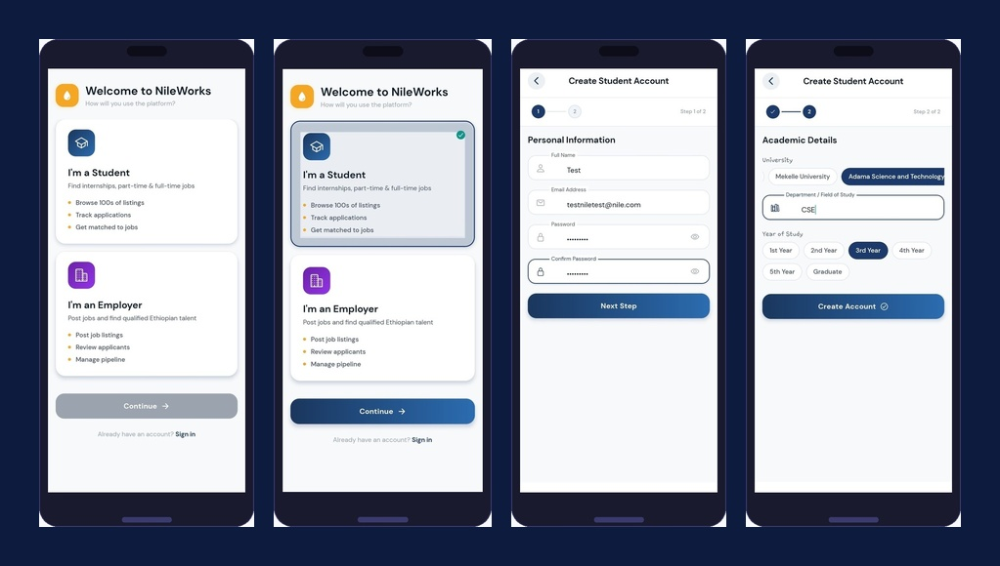
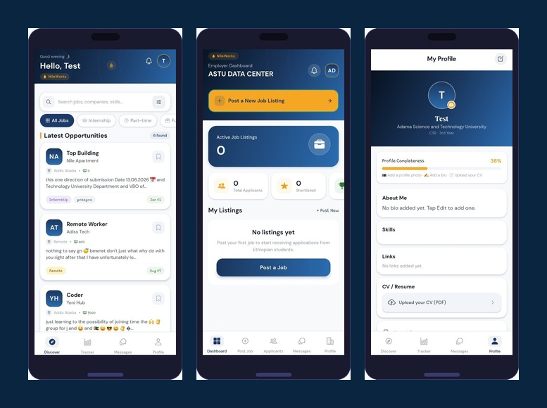
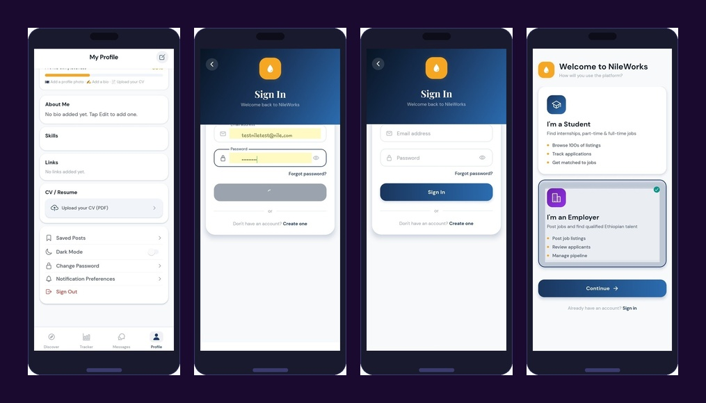
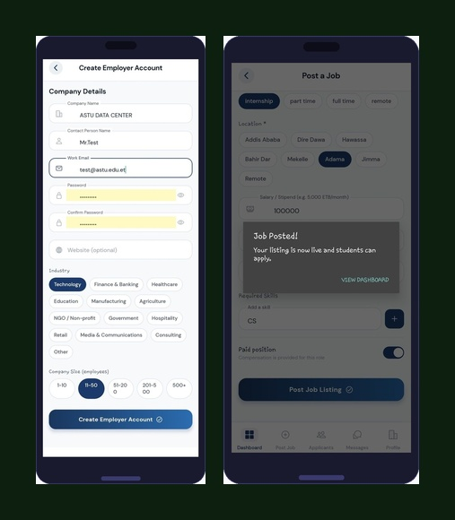

<div align="center">


<br/><br/>

# 🌊 NileWorks

### *Bridging Ethiopian University Students with Real Opportunities*

NileWorks is a full-stack mobile platform that connects Ethiopian university students with internships, part-time, and entry-level jobs — while giving employers the tools to post listings, review applicants, and hire efficiently.

[Features](#-features) · [Screenshots](#-screenshots) · [Tech Stack](#-tech-stack) · [Setup](#-local-development-setup) · [API Overview](#-api--backend-highlights) · [Team](#-team)

</div>

---

## 📖 About The Project

The Ethiopian job market presents unique challenges for university students: listings are scattered, informal, and often inaccessible. NileWorks centralizes opportunities with a localized, mobile-first experience — built by ASTU students, for Ethiopian students.

**Two user roles, one platform:**

| 🎓 Students | 🏢 Employers |
|---|---|
| Browse 100s of curated listings | Post jobs with detailed requirements |
| Track every application in one place | Review applicants & download CVs |
| Get matched to relevant opportunities | Manage your hiring pipeline |
| Message employers directly | Chat with candidates in real time |
| Build a profile with CV upload | Monitor recruitment via dashboard |

---

## 📸 Screenshots

### Onboarding & Authentication

> Role selection → Sign in / Register → Two-step student or employer account creation



---

### Student Experience

> Personalized job discovery → Detailed listings → Profile & CV management



---

### Employer Dashboard

> Role selection → Company registration → Dashboard with active listings & applicant stats



---

### Job Posting

> Full job form with type, location, salary, skills → Live confirmation



---

## ✨ Features

### For Students
- 🔍 **Discover** — Browse internships, part-time, full-time, and remote listings
- 🎯 **Filter & Search** — By job type, location, skills, and salary
- 📊 **Application Tracker** — Visual pipeline showing every application's status
- 👤 **Profile Builder** — Showcase your university, department, year, skills, and links
- 📄 **CV Upload** — PDF upload via Cloudinary; downloadable by employers
- 💬 **Real-Time Messaging** — Chat directly with recruiters via Socket.io

### For Employers
- 📝 **Post Jobs** — Title, description, type, location, salary, required skills, deadlines
- 👥 **Applicant Management** — Review profiles, shortlist candidates, track pipeline
- 📥 **CV Downloads** — Access student CVs directly from the dashboard
- 📊 **Dashboard Analytics** — Active listings count, total applicants, shortlisted stats
- 💬 **Instant Messaging** — Communicate with applicants without leaving the platform

---

## 🛠 Tech Stack

```
┌─────────────────────────────────────────────────────────┐
│                    NILEWORKS STACK                       │
├───────────────────────┬─────────────────────────────────┤
│  Mobile Frontend      │  React Native + Expo             │
│  Navigation           │  React Navigation                │
│  Backend API          │  Node.js + Express.js            │
│  Database             │  MongoDB Atlas + Mongoose        │
│  Real-Time            │  Socket.io                       │
│  Auth                 │  JWT (Access + Refresh Tokens)   │
│  Media Storage        │  Cloudinary + Multer             │
│  Testing              │  Jest                            │
└───────────────────────┴─────────────────────────────────┘
```

---

## 📁 Project Structure

```
NileWorks/
├── backend/
│   ├── controllers/        # Route logic (auth, jobs, users, messages)
│   ├── models/             # Mongoose schemas
│   ├── routes/             # API route definitions
│   ├── middleware/         # Auth guards, file handling
│   ├── socket/             # Socket.io event handlers
│   └── server.js           # App entry point
│
├── frontend/
│   ├── screens/            # App screens (Student & Employer flows)
│   ├── components/         # Reusable UI components
│   ├── navigation/         # Stack & tab navigators
│   ├── constants/          # API endpoints, theme colors
│   └── App.js              # Root component
│
├── tests/                  # Jest test suites
├── .env.example            # Environment variable template
└── README.md
```

---

## ⚙️ Local Development Setup

### Prerequisites

Make sure you have these installed:

- [Node.js](https://nodejs.org/) v18 or later
- npm
- [Expo Go](https://expo.dev/client) on your mobile device
- [MongoDB Atlas](https://www.mongodb.com/atlas) account
- [Cloudinary](https://cloudinary.com/) account

---

### 1. Clone the Repository

```bash
git clone https://github.com/yonas-woldeyohanis/Nileworks-group-project.git
cd Nileworks-group-project
```

---

### 2. Backend Setup

```bash
cd backend
npm install
```

Create a `.env` file inside `backend/`:

```env
MONGO_URI=your_mongodb_connection_string

CLOUDINARY_CLOUD_NAME=your_cloud_name
CLOUDINARY_API_KEY=your_api_key
CLOUDINARY_API_SECRET=your_api_secret

JWT_ACCESS_SECRET=your_access_secret
JWT_REFRESH_SECRET=your_refresh_secret

EMAIL_USER=your_email_address
EMAIL_PASS=your_email_password
```

Start the dev server:

```bash
npm run dev
```

> API runs at `http://localhost:5000`

---

### 3. Frontend Setup

Open a new terminal:

```bash
cd frontend
npm install
```

Update your API base URL in `frontend/constants/endpoints.js`:

```js
export const BASE_URL = 'http://192.168.x.x:5000/api/v1';
// Replace with your machine's local IPv4 address
```

Launch the Expo server:

```bash
npx expo start
```

Scan the QR code using **Expo Go** on your phone.

> ⚠️ Your phone and development machine must be on the **same Wi-Fi network**.

---

### 4. Run Tests

```bash
npm test
```

---

## 🔌 API & Backend Highlights

| Area | Details |
|---|---|
| Architecture | RESTful API with modular controllers and routes |
| Authentication | JWT with access + refresh token rotation |
| Real-Time | Socket.io for bidirectional chat events |
| File Handling | Multer parses uploads; Cloudinary stores them |
| Media | Student CVs (PDF) and employer logos |
| Security | Route guards via middleware on all protected endpoints |

**Core API Endpoints (prefix `/api/v1`):**

```
POST   /auth/register/student     Register a student account
POST   /auth/register/employer    Register an employer account
POST   /auth/login                Sign in (returns JWT tokens)
POST   /auth/refresh              Refresh access token

GET    /jobs                      List all active job postings
POST   /jobs                      Create a new job listing (employer)
GET    /jobs/:id                  Get job details
DELETE /jobs/:id                  Delete a listing (employer)

GET    /applications/me           Get student's applications
POST   /applications/:jobId       Apply to a job
PATCH  /applications/:id          Update application status (employer)

GET    /messages/:conversationId  Fetch chat messages
POST   /messages                  Send a message
```

---

## 🗺 User Flow Overview

```
┌─────────── STUDENT ────────────────────────────────────┐
│                                                         │
│  Welcome Screen → Select "Student" → Register (2 steps)│
│      ↓                                                  │
│  Discover Feed → Browse / Filter Jobs                   │
│      ↓                                                  │
│  Job Detail → Apply → Track in Tracker Tab              │
│      ↓                                                  │
│  Message Employer ↔ Real-Time Chat                      │
│                                                         │
└─────────────────────────────────────────────────────────┘

┌─────────── EMPLOYER ───────────────────────────────────┐
│                                                         │
│  Welcome Screen → Select "Employer" → Register Company  │
│      ↓                                                  │
│  Dashboard → Post New Job Listing                       │
│      ↓                                                  │
│  Applicants Tab → Review Profiles → Shortlist           │
│      ↓                                                  │
│  Message Applicant ↔ Real-Time Chat                     │
│                                                         │
└─────────────────────────────────────────────────────────┘
```

---

## 🚀 Roadmap

- [ ] Push notifications (Expo Notifications)
- [ ] AI-powered job recommendations based on profile
- [ ] In-app interview scheduling
- [ ] Admin moderation dashboard
- [ ] Company verification badge system
- [ ] Amharic / multi-language support
- [ ] Analytics for employers (views, conversion rates)

---

## 👥 Team

This project was developed as a group capstone at **Adama Science and Technology University (ASTU)**.

| Name | Role |
|---|---|
| Yonas Woldeyohanis | Full-Stack Developer |
|  Gadisa Solomon| Full-Stack Developer|
|  Ziyad Ayub | Full-Stack Developer |
|  Matiwos Teferi | Full-Stack Developer |
|  Rihobot Girma | Full-Stack Developer|

---

## 📄 License

Distributed under the **MIT License**. See [`LICENSE`](LICENSE) for details.

---

<div align="center">

Built with ❤️ in Ethiopia 🇪🇹

**[⬆ Back to top](#-nileworks)**

</div>
